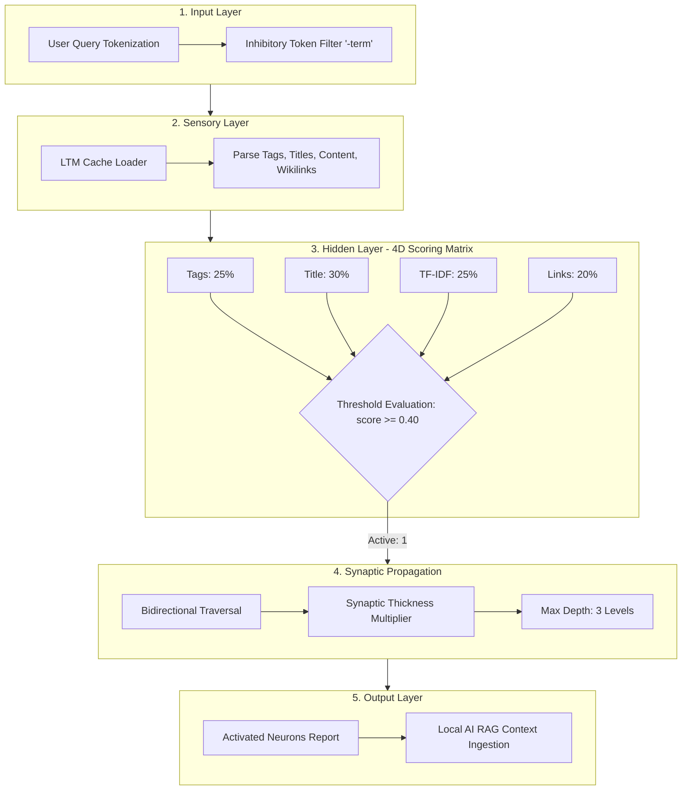

Aquí tienes el rediseño optimizado del archivo `.md`. Se han eliminado los emojis y caracteres decorativos, incorporando **badges vectoriales (Shields.io con iconos oficiales)**, **diagramas Mermaid interactivos y renderizables**, componentes colapsables (`<details>`), tablas estructuradas y **bloques de llamada nativos de GitHub / Obsidian (`[!NOTE]`, `[!TIP]`, `[!WARNING]`)** que despliegan iconos SVG automáticamente en visores Markdown modernos.

---

```markdown
<div align="center">

# Neural Vault Brain v2.0

**Neural binary query engine for Obsidian vaults with Local AI (RAG) capabilities**

<p>
  
  
  
  
  
</p>

</div>

---

## Overview

Neural Vault Brain models your personal knowledge base as a biological neural network:

| Component | Biological Analogy | Function |
| :--- | :--- | :--- |
| `.md` Note | **Neuron** | Unit of knowledge holding content, tags, and state |
| `[[WikiLink]]` | **Synapse** | Weighted edge routing context across concepts |
| Search Query | **Action Potential** | Electrical impulse triggering network traversal |
| Output | **Binary State** | Activated (`1`, relevant) or Inactive (`0`, irrelevant) |

Compatible with all major AI coding assistants: **Antigravity**, **Claude Code**, **OpenClaw**, **ChatGPT**, **Cursor**, **Copilot**, **Codex**, **Aider**, and **Windsurf**.

---

## System Architecture



---

## Release Notes (v2.0)

> [!NOTE]
> **Local AI RAG (`--ask`)**: Seamless connection with Ollama or LM Studio to execute neural retrieval-augmented queries directly against your vault.

* **Long-Term Memory Cache**: Instantaneous startup with file modification detection (only updated notes are re-parsed).
* **TF-IDF Mathematical Scoring**: Query tokens are weighted based on their frequency distribution within the vault.
* **Bidirectional Propagation**: Neural impulses travel both downstream (outgoing links) and upstream (incoming references).
* **Inhibitory Filters**: Prefix any token with `-` (e.g., `-wpf`) to completely suppress matching nodes.
* **Synaptic Thickness**: Enhanced weight multipliers assigned to headers and alias links.

---

## Quick Start

### Installation

```bash
git clone https://github.com/aandreve/neural-vault-brain.git
cd neural-vault-brain
```

> [!TIP]
> **Zero External Dependencies**: Built entirely with the standard Python 3.7+ library.

### Execution Modes

```bash
# 1. Interactive CLI Mode
python scripts/neural_vault_brain.py

# 2. Local AI Query (Requires active Ollama / LM Studio)
python scripts/neural_vault_brain.py --ask "Summarize my recent architecture notes"

# 3. Direct Search with Inhibitory Token
python scripts/neural_vault_brain.py "machine learning -python"

# 4. Structured JSON Output
python scripts/neural_vault_brain.py --json "database optimization"
```

---

## AI Assistant Integration

<details open>
<summary><b>Generic Context Extraction</b></summary>

```bash
python scripts/neural_vault_brain.py "my query"
```
</details>

<details>
<summary><b>Claude Code Configuration</b></summary>

Integrate inside a custom slash command or `CLAUDE.md`:

```bash
CONTEXT=$(python scripts/neural_vault_brain.py "my question")
# Inject $CONTEXT into prompt
```
</details>

<details>
<summary><b>Cursor IDE Rules</b></summary>

Append dynamic vault context into `.cursorrules`:

```bash
python scripts/neural_vault_brain.py "my topic" >> .cursorrules
```
</details>

---

## Configuration

Settings are controlled via `scripts/neural_config.json`:

```json
{
  "vault_path": "/path/to/your/obsidian/vault",
  "weights": {
    "tags": 0.25,
    "title": 0.30,
    "content": 0.25,
    "inbound_links": 0.20
  },
  "threshold": 0.40,
  "synapse_bonus": 0.15,
  "backward_synapse_bonus": 0.05,
  "max_propagation_depth": 3,
  "exclude_patterns": [".obsidian", ".smart-env", "scripts", ".base"],
  "local_ai": {
    "provider": "ollama",
    "endpoint": "http://localhost:11434/api/generate",
    "model": "llama3",
    "system_prompt": "You are Neural Brain, an expert assistant...",
    "context_max_chars": 12000
  }
}
```

### Parameter Tuning Reference

| Objective | Parameter | Recommended Adjustment |
| :--- | :--- | :--- |
| Increase search recall (more results) | `threshold` | Lower value (e.g., `0.30`) |
| Increase search precision (fewer results) | `threshold` | Higher value (e.g., `0.50`) |
| Expand neural traversal depth | `max_propagation_depth` | Increase integer (`4` - `5`) |
| Expand RAG context window | `local_ai.context_max_chars` | Increase limit (`16000`+) |

---

## Vault Training Protocols

Your Obsidian vault represents the physical neural network. Structural maintenance optimizes context synthesis:

```
[Knowledge Base] ---> [Structured Links] ---> [Weighted Tags] ---> [Optimized AI Context]
```

<details open>
<summary><b>1. Strengthen Synapses (Propagation Layer)</b></summary>

Connect new concepts to existing nodes using `[[WikiLinks]]`.
* Activation in Note A routes an electrical threshold bonus to Note B.
* **Header Priority**: Links placed inside header tags (`# Heading`) receive double synaptic weight.
</details>

<details>
<summary><b>2. Refine Receptors (Tagging Strategy)</b></summary>

Tags carry a 25% base scoring weight as direct conceptual triggers.
* Define technical domains using specific tags (e.g., `#sql`, `#auth`, `#backend`).
* Precise tags guarantee immediate activation upon query execution.
</details>

<details>
<summary><b>3. Establish Hub Neurons (Maps of Content)</b></summary>

Inbound links account for 20% of node scoring (Popularity Factor).
* Central indices (MOCs like `[[000-INDEX]]` or `[[Python-Snippets]]`) function as high-sensitivity junction hubs.
</details>

<details>
<summary><b>4. Declarative Context Formatting</b></summary>

The `--ask` engine injects activated node content directly into the model context.
* Prefer clear, declarative sentences over ambiguous pronouns.
* Example: Use *"The server uses Nginx as a reverse proxy"* instead of *"It is used for proxying"*.
</details>

---

## Troubleshooting

> [!WARNING]
> **Connection Refused (`WinError 10061`) when executing `--ask`**
> * Verify that the local engine daemon is active (Ollama or LM Studio).
> * Validate the target endpoint in `neural_config.json`:
>   * **Ollama default**: `http://localhost:11434/api/generate` (`"provider": "ollama"`)
>   * **LM Studio default**: `http://localhost:1234/v1/chat/completions` (`"provider": "openai"`)

> [!IMPORTANT]
> **No relevant context found by the neural network**
> * Remove conversational stopwords from queries (`what`, `is`, `tell`, `how`).
> * Execute queries with key terms (e.g., `--ask "testing framework"` instead of `--ask "what is the best testing framework"`).
> * Lower the `threshold` parameter in `neural_config.json`.

---

## Directory Structure

```text
neural-vault-brain/
├── scripts/
│   ├── neural_vault_brain.py   # Core engine, CLI and RAG interface
│   └── neural_config.json      # Configuration parameters
├── README.md                   # Technical documentation
└── LICENSE                     # MIT License specification
```

---

## License & Credits

* **License**: Released under the [MIT License](LICENSE).
* **Author**: Developed by **Amir Andreve**.
* **Design Philosophy**: Neural graph traversal applied to decentralized personal knowledge management.
```
